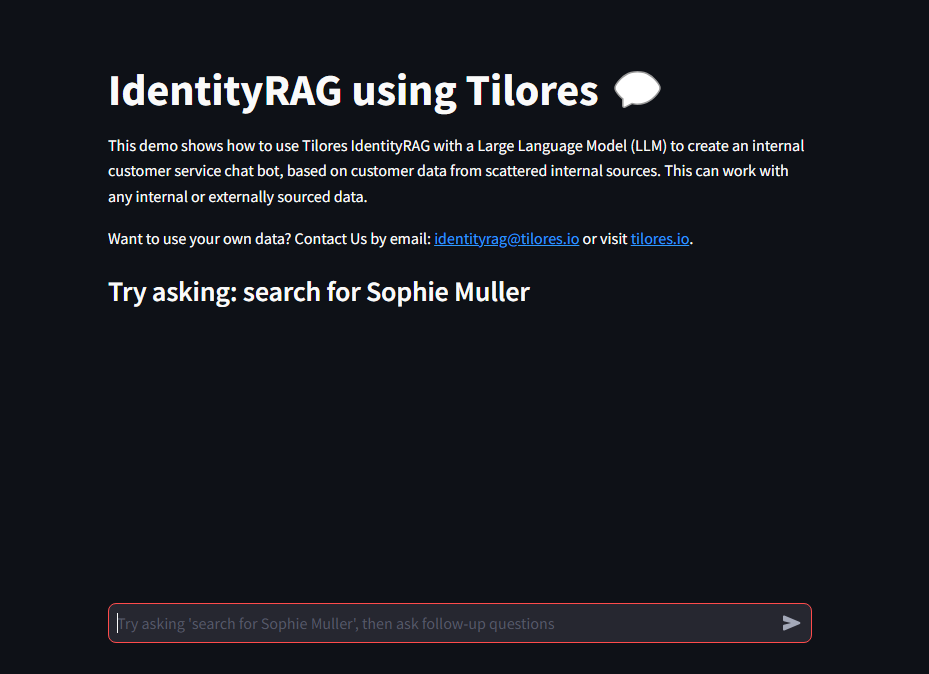

<h1 align="center">
IdentityRAG<br/>Customer Insights Chatbot
</h1>

<h3 align="center">
Connect to your customer data using any LLM and gain actionable insights.
</h3>

<p align="center">
| <a href="https://identityrag.com"><b>IdentityRAG</b></a> | <a href="https://identity-rag.streamlit.app"><b>Live Demo</b></a> | <a href="https://linkedin.com/company/tilores"><b>LinkedIn</b></a> |
</p>

https://github.com/user-attachments/assets/b6639333-54ae-4d20-a585-c8cf604036d6

## What is IdentityRAG?

IdentityRAG is a retrieval-augmented generation system that integrates identity
resolution capabilities to provide accurate, context-aware responses about
specific customers. It retrieves unified customer data across disparate sources
to create a comprehensive golden record before generating LLM responses,
ensuring answers are based on an accurate, deduplicated view of the customer.

| LangChain Integration                          |
|------------------------------------------------|
|    |

## Key Features
* <b>Unify</b> - bring data together from various sources.
* <b>Search</b> - find and retrieve all relevant customer data with fuzzy matching.
* <b>Consolidate</b> - combine it meaningfully by creating a golden record.
* <b>Disambiguate</b> - resolve conflicts/unclear matches.
* <b>Deduplicate</b> - remove redundancies where repeated with no extra value.

| Multiple Customer Data Sources  / Knowledge Bases |
|---------------------------------------------------|
|   |

## Live Demo
If you don't want to use your own LLM keys then give it a try on the following live demo.

| Live Demo |
|--|
|[](https://identity-rag.streamlit.app)|

## Getting Started

1. Clone this repository
2. Install dependencies: `pip install -r requirements.txt`
3. Set up your environment variables (see Configuration section)
4. Run the demo server: `chainlit run chat.py -w`
5. Open [http://localhost:8000](http://localhost:8000) in your browser
6. Try asking "search for Sophie Muller"

## Configuration

### 1. Configure Customer Data Access:
```bash
export TILORES_API_URL='https://8edvhd7rqb.execute-api.eu-central-1.amazonaws.com'
export TILORES_TOKEN_URL='https://saas-umgegwho-tilores.auth.eu-central-1.amazoncognito.com/oauth2/token'
export TILORES_CLIENT_ID='3l3i0ifjurnr58u4lgf0eaeqa3'
export TILORES_CLIENT_SECRET='1c0g3v0u7pf1bvb7v65pauqt6s0h3vkkcf9u232u92ov3lm4aun2'
```

### 2. Configure LLM Access:
#### Option 1: ChatGPT using OpenAI keys
```bash
export OPENAI_API_KEY='your openAI key'
export OPENAI_MODEL_NAME='gpt-4o-mini'
```

#### Option 2: Anthropic Claude using AWS Bedrock keys
```bash
export LLM_PROVIDER='Bedrock'
export BEDROCK_CREDENTIALS_PROFILE_NAME='your configured AWS profile name with bedrock access'
export BEDROCK_REGION='us-east-1'
export BEDROCK_MODEL_ID='anthropic.claude-3-5-sonnet-20240620-v1:0'
```
> [!IMPORTANT]  
> The aws profile needs to have access to the model with action
`InvokeModelWithResponseStream`. Also make sure the model is enabled in bedrock
console and in the correct region.

## Using Your Own Data

To use your own data you will need to create a Tilores instance and get your free Tilores API credentials,
Here's how to do that:
* Visit [app.tilores.io](https://app.tilores.io) and sign up for free.
* Click on "**_Switch to Instance View_**" on the bottom right.
* Select "**_Upload Data File_**" option and proceed. It is recommended to use csv file format.
* If the file has well named headers the matching will be automatically configured and you can proceed with the instance
  creation without any further changes. The deployment will take around 3-5 minutes.
* Once the deployment is done, navigate to "**_Manage Instance_**" -> "**_Integration_**" -> "**_GraphQL API_**"
* The first URL is the `TILORES_GRAPHQL_API`, and the second is `TILORES_TOKEN_URL` you will need to export these two
  values as shown in Configuration section.
* Then click `CREATE NEW CREDENTIALS` and store both values. Then export each one into its corresponding environment
  value `TILORES_CLIENT_ID` and `TILORES_CLIENT_SECRET`.
* Now run `chainlit run chat.py -w` and ask to search for one of the records in your data.

## PDF Link Lookup Tool

If you want to test the automatic lookup from the PDFs, you also must have the poppler-utils installed:
```
sudo apt-get install poppler-utils